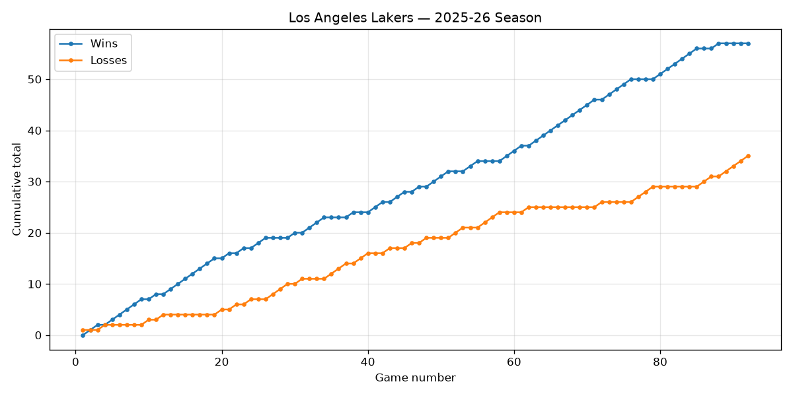

# NBA Stats Tracker

A small automated data pipeline that tracks one NBA team's season. Every day it
pulls the team's latest game results from a public sports API, stores them in a
database without creating duplicates, and redraws a chart of the season.



## What it does

This is a classic **ETL** pipeline — Extract, Transform, Load:

- **Extract** — calls the [BALLDONTLIE](https://www.balldontlie.io) API to get the
  team's games for the current season.
- **Transform** — turns each raw game into a clean row: opponent, home/away,
  the score, and whether the team won or lost.
- **Load** — saves the rows into a SQLite database. Each game is keyed by its
  game id, so running the pipeline again never creates duplicates — it just
  updates anything that changed. (This "safe to re-run" property is called
  *idempotency*.)

It then draws `season_chart.png` showing cumulative wins and losses.

The pipeline runs automatically once a day using **GitHub Actions** and commits
the updated database and chart back to the repo, so the chart above always
stays current — no manual work after setup.

## Setup

1. **Get a free API key.** Sign up at [app.balldontlie.io](https://app.balldontlie.io)
   and copy your key from the account page.

2. **Pick your team.** Open `fetch_games.py` and change the `TEAM_NAME` line near
   the top to the team you follow, e.g. `TEAM_NAME = "Golden State Warriors"`.

3. **Run it locally to test:**
   ```bash
   pip install -r requirements.txt
   export BALLDONTLIE_API_KEY="your-key-here"   # Windows: set BALLDONTLIE_API_KEY=your-key-here
   python fetch_games.py
   ```
   You should get `games.db` and `season_chart.png`.

4. **Automate it on GitHub.** Push this folder to a GitHub repo, then go to
   **Settings → Secrets and variables → Actions → New repository secret** and add
   a secret named `BALLDONTLIE_API_KEY` with your key as the value. The workflow
   in `.github/workflows/update.yml` will run it daily. (You can also trigger a
   run immediately from the **Actions** tab using "Run workflow".)

## Files

| File | What it is |
|------|------------|
| `fetch_games.py` | The pipeline: extract, transform, load, and chart. |
| `requirements.txt` | The two Python libraries it needs. |
| `.github/workflows/update.yml` | The schedule that runs it automatically. |
| `games.db` | The SQLite database (created on first run). |
| `season_chart.png` | The chart (created on first run). |

## Ideas to extend it later

- Track point differential per game, or home vs away record.
- Add a second team and compare them on the same chart.
- Swap SQLite for a CSV and load it into a notebook for deeper analysis.
